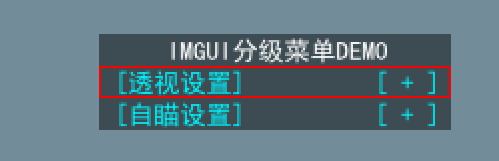
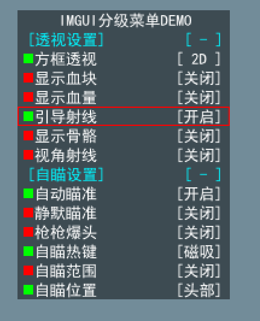

# IMGUI-Hacker-foldable-menu
This is modifiy by ImGui and it can use in game hacker menu. 
It has flodable second-level menu.

## Preview

## Environment
Visual Studio 2019,DirectX SDK.
## Controls

<kbd>Up</kbd> and <kbd>Down</kbd>  control menu up and down.
<kbd>Right</kbd> and <kbd>Left</kbd> control menu open and close. 
